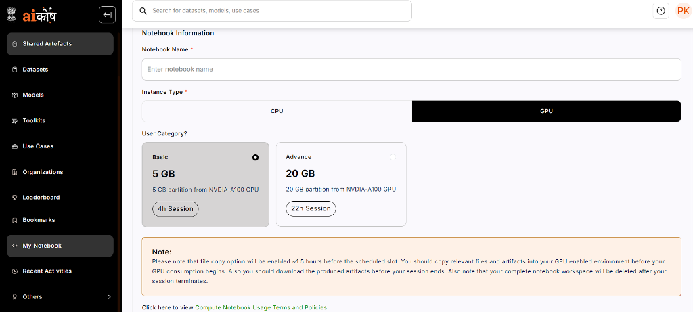
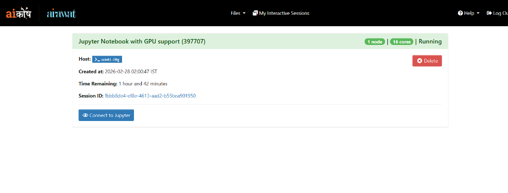
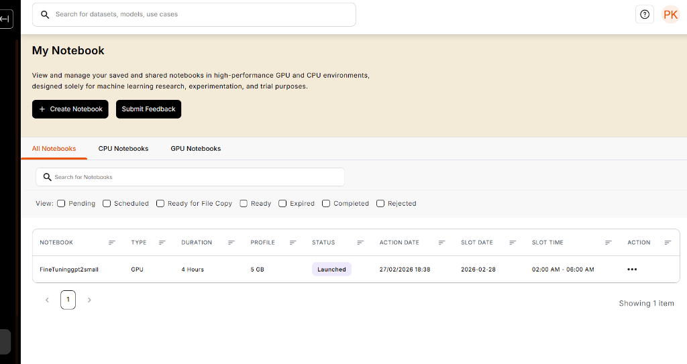
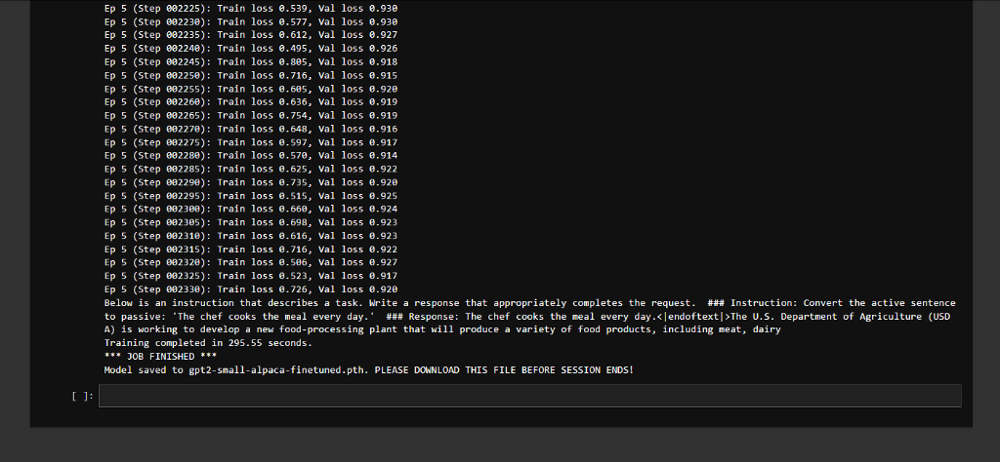

# Fine-Tuning GPT-2 Small (124M) on Alpaca Instructions

This project fine-tunes OpenAI's **GPT-2 Small (124M)** model for instruction-following tasks using the [Alpaca-style instruction dataset](https://raw.githubusercontent.com/rasbt/LLMs-from-scratch/main/ch07/01_main-chapter-code/instruction-data.json).

The implementation follows [Sebastian Raschka's *Build a Large Language Model (From Scratch)*](https://github.com/rasbt/LLMs-from-scratch) — Chapter 7.

## GPU Access

> **GPU compute for this project was provided by the Government of India's [AIKosh](https://aikosh.ai/) platform.**

Training was performed on an **NVIDIA A100 GPU (5GB partition)** allocated through AIKosh's cloud infrastructure.

### AIKosh GPU Allocation


### GPU Notebook Session (Airawat)


### Notebook Dashboard


### Training Completed Successfully


## Project Structure

| File | Description |
|------|-------------|
| `run_alpaca_finetuning.py` | Main training script — data loading, training loop, and model saving |
| `previous_chapters.py` | Helper functions from earlier chapters (GPTModel, weight loading, training utilities) |
| `gpt_download.py` | Downloads pretrained GPT-2 weights from OpenAI's TensorFlow checkpoints |
| `gpt2-small-alpaca-finetuned.pth` | Fine-tuned model weights *(not tracked in Git — too large)* |

## How to Run

### 1. Install dependencies

```bash
pip install torch tiktoken numpy tqdm tensorflow
```

### 2. Run fine-tuning

```bash
python run_alpaca_finetuning.py
```

The script will automatically:
- Download the Alpaca instruction dataset
- Download pretrained GPT-2 Small weights
- Fine-tune for 2 epochs
- Save the model to `gpt2-small-alpaca-finetuned.pth`

## Training Details

| Parameter | Value |
|-----------|-------|
| Base Model | GPT-2 Small (124M params) |
| Dataset | Alpaca Instructions (1,100 samples) |
| Batch Size | 2 |
| Learning Rate | 5e-5 |
| Epochs | 2 |
| Optimizer | AdamW (weight decay 0.1) |
| Precision | bfloat16 (on A100) |
| Max Sequence Length | 1024 |

## Acknowledgements

- [Sebastian Raschka](https://github.com/rasbt) — *Build a Large Language Model (From Scratch)*
- [Government of India — AIKosh](https://aikosh.ai/) — GPU compute resources
